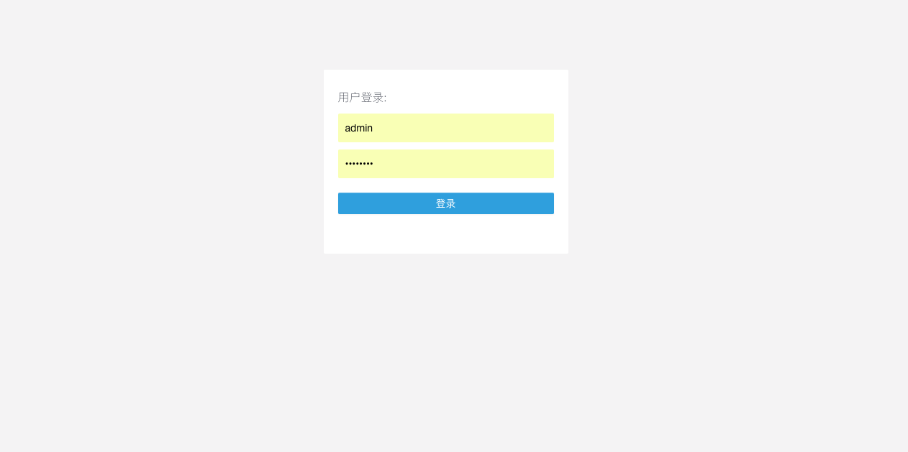
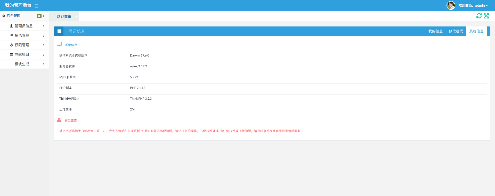
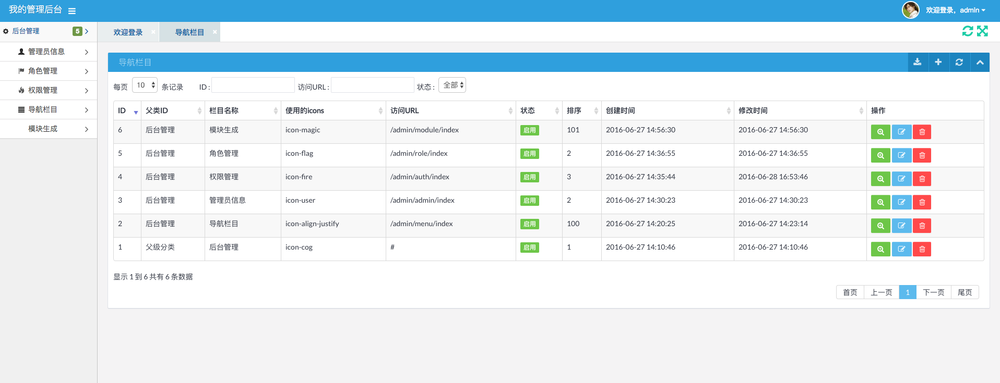

ThinkPHP Admin
=======================
 
使用ThinkPHP3.2 写的一个简单的后台管理项目

## 安装说明
### git clone 项目
```
git clone git@github.com:myloveGy/thinkphp3.2-simpli-admin.git
```
### 将mysql 数据文件导入数据库(/Public/docs/project.sql)
### 配置虚拟目录(需要开启路由重写)，后台地址：域名/admin

>超级管理员账号: admin 密码 admin123

>普通管理员账号: liujinxing 密码 admin123

## 预览页面
1. 登录页面

2. 后台首页

3. 数据管理
